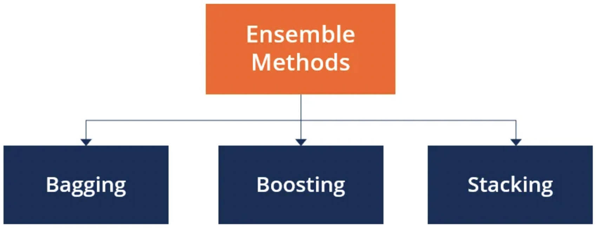

## Ensemble Learning

Ensemble learning is a technique for combining several machine learning algorithms to make a better and quality prediction. There are several ensemble methods namely;
- Bagging
- stacking
- Voting
- Boosting

The most widely used methods are shown on the flowchart below.

The purpose of this project is to implement ensemble learning methods, more specifically bagging, voting and boosting to solve a classification problem.

We considered a breast cancer dataset, where we have to use our implemented(from scratch) ensemble methods to predict whether a person has a benign cancer or malignant cancer. Our dataset contains two classes: 2 for benign and 4 for malignant.

Machine learning models that we use in implementing the various ensemble methods are;

- Decision Trees
- Logistic regression
- SVM
- FCN

## Create virtual environment 

- $ python3 -m venv ENV_NAME

## Activate your environment ##

- $ source ENV_NAME/bin/activate

## Requirement installations 
- $ pip install numpy
- $ pip install pandas
- $ pip install sklearn
- $ pip install imblearn
- $ pip list

To run the main.py, make sure to install all the requirements by:

- $ pip install -r requirements.txt 

## Training the model 

- $ python3 main.py --model MODEL_NAME 

## Example of running models 

- $ python3 main.py --model adaboost

- $ python3 main.py --model bagging

- $ python3 main.py --model voting

## References 
- [Dataset source](https://archive.ics.uci.edu/ml/datasets/breast+cancer+wisconsin+%28original%29)
- [Ensemble Learning](https://ieeexplore.ieee.org/abstract/document/7348652)
- [Create Virtual Environment](https://linuxize.com/post/how-to-create-python-virtual-environments-on-ubuntu-18-04/)

## Contributors
- Annine Duclaire KENNE
- Nancy Fosua BOAKYE 
- Pauline Ornela MEGNE CHOUDJA
- ADOU Kouamé Mathurin 

